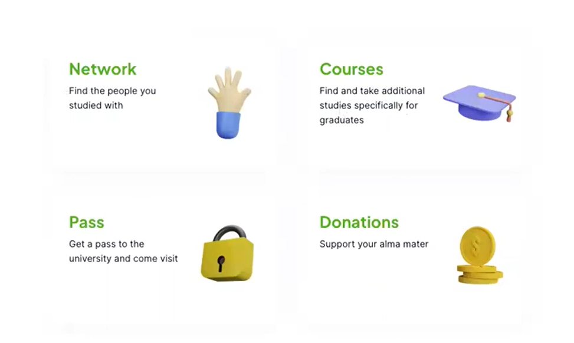

Welcome to the Alumni Portal, your gateway to staying connected with your alma mater and accessing various resources tailored to alumni needs. This innovative platform is designed to bridge the gap between alumni and their university, offering a seamless experience for engagement and interaction.

### Brief Overview:

The Alumni Portal is a comprehensive digital platform that facilitates alumni engagement, event management, course participation, and access to university facilities. It integrates cutting-edge technologies to provide alumni with intuitive features and seamless navigation.

### Purpose and Features:

1. **Event Management:** Stay informed about upcoming events happening at your university. From reunions to networking events, the portal keeps you updated on all the latest happenings.

2. **Elective Courses Participation:** Alumni can participate in elective courses offered by the university, enabling continuous learning and skill enhancement.

3. **Pass Ordering:** Need access to university facilities for various purposes? Alumni can conveniently request passes through the portal, streamlining the process for entry.

4. **Customer Complaints:** Seamless communication is key. Alumni can submit complaints directly through the dedicated Telegram group mentioned on the website, ensuring quick resolution and feedback.

5. **User Data Management:** Administrators have the ability to manage user requests effectively. Whether accepting or denying requests, admins can provide feedback and maintain smooth operations.

### Benefits for Users:

- **Connect with Alumni:** Reconnect with former classmates, professors, and other alumni members to foster professional relationships and networking opportunities.
  
- **Stay Updated on Events:** Never miss out on university events, ranging from academic seminars to social gatherings, keeping you engaged with your alma mater's community.

- **Access to Job Opportunities:** Stay informed about job openings and career opportunities, leveraging the extensive alumni network for professional growth and development.

- **Convenient Pass Ordering:** Easily request passes for accessing university facilities, simplifying the process for alumni returning to campus.

- **Continuous Learning:** Engage in lifelong learning through participation in elective courses, enhancing skills and knowledge in various fields.

The Alumni Portal is more than just a platform; it's a vibrant community hub designed to enrich your post-graduation journey and foster lifelong connections with your university. Join us today and embark on a journey of discovery, growth, and camaraderie.

Continue with [User Guide]()
or jump to [Developer Guide]()